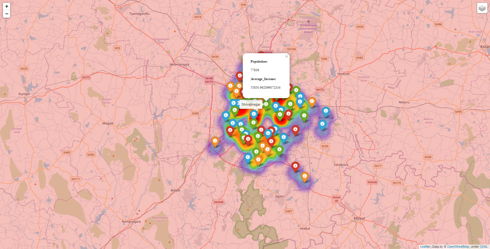
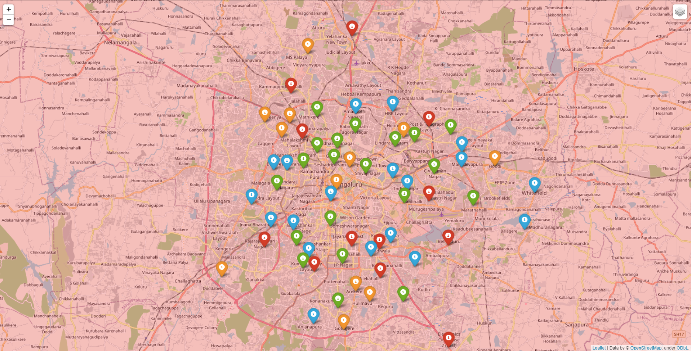

<h2 align="center">Web Mpping</h2>
<h3 align="center">Population and Average Income</h3>

---

 Small web map with world population and with marker for population and average income in banagalore.
      

## 🏁 Getting Started 

### Prerequisites

--python folium--

just run python map.py to get the map.html

